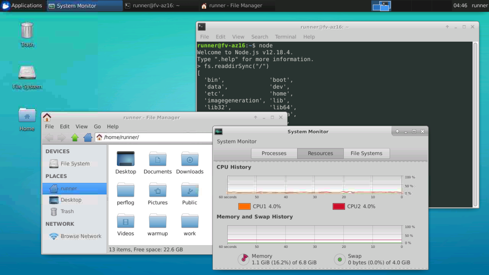

# Reverse Linux VNC for GitHub Actions
Enable VNC access on GitHub Actions VMs for general use.



## Usage
1) Create an account on [ngrok](https://dashboard.ngrok.com/signup), and copy your auth token displayed [here](https://dashboard.ngrok.com/auth)

2) Fork this repository

3) Go to the Settings tab of your repository, and go to Secrets, add the following secrets:
```
Name: NGROK_AUTH_TOKEN
Example Value: (obviously you insert the ngrok auth token of your account that you obtained in step 1)

Name: VNC_PASSWORD
Example Value: password
The VNC password that you will be using, if exceeds more than 8 characters, it will be truncated

Name: VNC_DEPTHVALUE
Example Value: 16
This is the default color depth that the VNC will be using, the minimum acceptable value is 8
But i recommend you to set it at 16

Name: VNC_SCREENSIZE
Example Value: 800x600
This will be the screen resolution in your VNC session, i don't know a minimal value but it's up to you anyway.
```

All of those secrets are required for the script to work, if you forget to add one, then it will throw an error

4) Trigger an build, by editing this README or uploading anything to your repository, don't modify the contents of the resources or scripts folders

5) Go to the Actions tab of your repository, go to your build process and wait until the pre-last step, that it will hang forever while setting ngrok's tunnel

6) Visit ngrok's tunnel list [dashboard](https://dashboard.ngrok.com/status/tunnels)

7) Take note of the active tunnel host and port

8) Connect to the host and port combination with a VNC client of your preference

9) If it requires an username, write "runner" and as password, the password that you wrote in the VNC_PASSWORD secret in step 3

10) Once connected, select "Use default panel layout" and Enjoy!

### Please note that the duration of the runners in GitHub Actions is for 6 hours, so, the VNC server lasts 6 hours